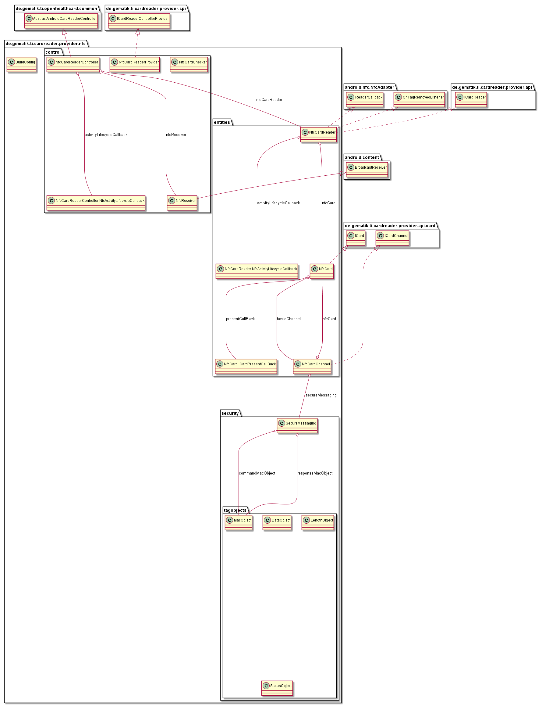
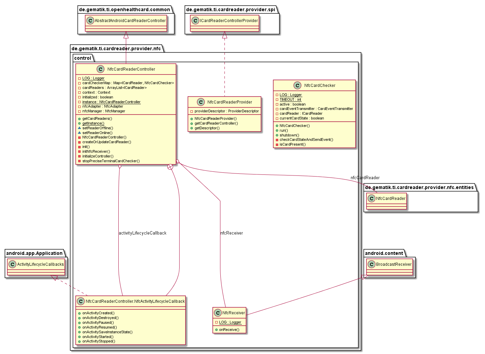
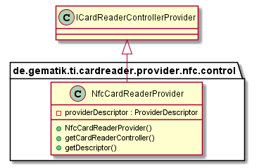
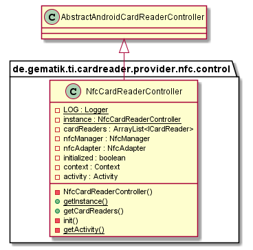
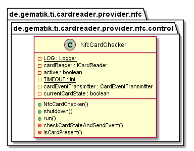
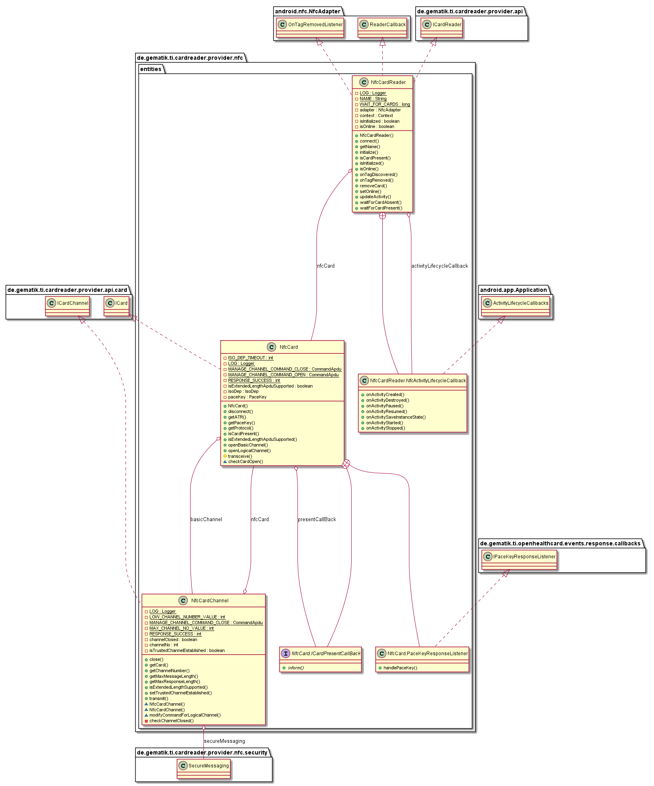
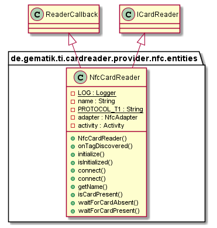
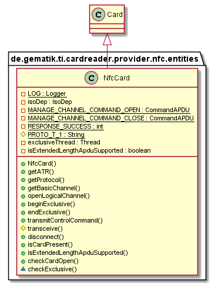
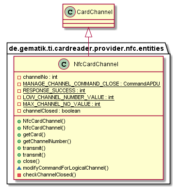
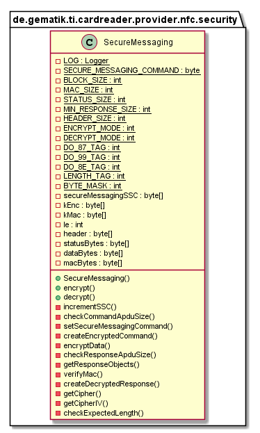

# NFCCardReaderProvider

## Introduction

This part describes the usage of low level CardReaderProvider for NFC CardReader in your application.

## API Documentation

Generated API docs are available at <https://gematik.github.io/ref-CardReaderProvider-NFC-Android>.

## License

Licensed under the [Apache License, Version 2.0](https://www.apache.org/licenses/LICENSE-2.0).

## Overview

  

### Integration

The NFC CardReaderProvider needs a descriptor behind `YOUR.PROVIDER\src\main\resources\META-INF\services` with filename
`de.gematik.ti.cardreader.provider.spi.ICardReaderControllerProvider` and the content of the package and class which implements the service provider interface
`de.gematik.ti.cardreader.provider.usb.nfc.control.NfcCardReaderProvider`.

## Hardware

The NFC CardReaderProvider supports the integrating of smart card functionality using NFC.

## Control

  

### NfcCardReaderProvider

The NfcCardReaderProvider class needs implementation of the interface 'ICardReaderControllerProvider' to handle listener and provide methods to inform connected listeners about card reader changes.

  

### NfcCardReaderController

The NfcCardReaderController class extends the abstract class 'AbstractCardReaderController' to handle necessary permissions and checking if the application context is set.
Returns a list with currently connected Tactivo cardReaders and informs about reader connection and disconnection.

  

### NfcReceiver

The NfcReceiver class extends the BroadCastReceiver class that receives and handles broadcast intents sent by {@link android.content.Context\#sendBroadcast(Intent)}.
The actions of the intents that are being handled are changes in the state of the NFC adapter.

  

### NfcCardChecker

The NfcCardChecker would automatically started for each connected NfcCardReader to monitor the current card status.
This checker send Events on EventBus for each present or absent card.
For triggering this changed would use the SmartCardIo methods `waitForCardAbsent` and `waitForCardPresent`.

  

## Entities

  

### NfcCardReader

The NFC Smart Card Reader implements the Interface ICardReader.
Works as Adapter to the Android NfcManager and uses the Android ReaderCallback from Android NfcAdapter to detect NFC SmartCards.

  

### NfcCard

A Smart Card with which a connection has been established.
NfcCard extends the abstract class Card.

  

### NfcCardChannel

A logical channel connection to a Smart Card.
It is used to exchange APDUs with a Smart Card the NfcCardReader class.
A NfcCardChannel object can be obtained by calling the method nfcCard.getBasicChannel() or NfcCard.openLogicalChannel().

  

## Security

Implements Secure Messaging for encrypting plain Command APDU and decrypting encrypted Response APDU.

  

### TagObjects

  

## Getting Started

### Build setup

To use CardReaderProvider for NFC CardReader on Android-Device in a project, you need just to include following dependency:

**Gradle dependency settings to use CardReaderProvider for NFC CardReader on Android-Device library.**

    dependencies {
        implementation group: 'de.gematik.ti', name: 'cardreader.provider.nfc', version: '1.1.2'
    }

**Maven dependency settings to use CardReaderProvider for NFC CardReader on Android-Device library.**

    <dependencies>
        <dependency>
            <groupId>de.gematik.ti</groupId>
            <artifactId>cardreader.provider.nfc</artifactId>
            <version>1.1.2</version>
        </dependency>
    </dependencies>
